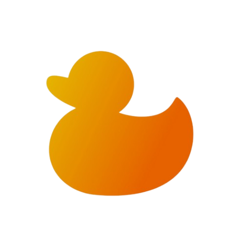

# Duck Framework


[](https://www.python.org/downloads/release/python-3100/)
[](https://github.com/duckframework/duck/stargazers)
[](https://github.com/duckframework/duck/network/members)
[](https://github.com/duckframework/duck/blob/main/LICENSE)
[](https://github.com/duckframework/duck/actions)
[](https://github.com/duckframework/duck/issues)
[](https://github.com/duckframework/duck/graphs/contributors)
[](#)
[](#)
[](#)
[](#)
[](#)
[](#)
[](#)
[](#)
[](#)
[](#)
[](#)
[](#)

**Duck** is a powerful, open-source, full-fledged Python-based **web server**, **framework**, and **reverse proxy** designed for building modern, customizable web applications — from small sites to large-scale platforms.  

**It simplifies web development with:**

1. **Built-in HTTPS support** for secure connections  
2. **Native HTTP/2 support** with **HTTP/1** backward compatibility [link](https://duckframework.xyz/documentation/https-and-http2.html)  
3. Hassle-free **free SSL certificate generation** with **automatic renewal** [link](https://duckframework.xyz/documentation/free-ssl-certificate.html)  
4. **Lively Component System** — with `VDom Diffing` (support for fast UI's) 
5. **WebSocket support** — modern websocket implementation with `per-message compression`.
6. Built-in [task automation](https://duckframework.xyz/documentation/automations.html) — no need for [cron jobs](https://en.m.wikipedia.org/wiki/Cron)  
7. Automatic **content compression** using `gzip`, `deflate` or `brotli`
8. Support for **chunked transfer encoding**  
9. Easy integration with existing **Django** projects using `django-add`  
10. Organized routing with **Duck** [`Blueprints`](https://duckframework.xyz/documentation/blueprint.html)
11. Full support for **async views** or asynchronous code even in `WSGI` environment
12. Dynamic project generation with `makeproject` (`mini`, `normal`, or `full`)  
13. Runs on both `WSGI` and `ASGI` environments, can even run `async` protocols like `HTTP/2` or `WebSockets` on `WSGI`.  
14. High-performance with low-latency response times  
15. **Resumable downloads** for large files  
16. Protection against **DoS**, **SQL Injection**, **Command Injection**, and other threats  
17. **Auto-reload** in debug mode for rapid development  
18. **Free production SSL** — no certificate costs  
19. **Automatic SSL renewal** using `certbot` plus Duck automation system
20. Comes with built-in web development tools and helpers  
21. Log management with `duck logs` and file-based logging by default  
22. Real-time system monitoring for CPU, RAM, Disk usage, and I/O activity with `duck monitor`
23. Highly **customizable** to fit any use case  

And more — see [feature list](https://duckframework.xyz/features)

## Upcoming Features

1. **HTTP/3 with QUIC** – Faster, modern transport for improved performance.  
2. **QUIC WebTransport** – A next-gen alternative to WebSockets for real-time communication.  
3. **Component Pre-rendering System** – A system to preload components in the background thread to reduce initial load times of component trees.
4. **Customizable Dashboards** – Tailor interfaces to your workflow and preferences.  
5. **MQTT (Message Queuing Telementry Transport) Integration** – Run your own broker and manage IoT devices with ease.  
6. **Duck WebApp to APK** – Easily convert a Duck web application to APK.
7. **DuckSight Hot Reload** – Instead of full reload on file changes, implement **hot reload** for the **DuckSight Reloader**. This is faster and efficient than full reload.
8. **Internal Updates** – Implement logic for listing and securely applying updates when available, utilizing cryptographic code signing (using standards like TUF) to verify GitHub-sourced updates, protecting against rollbacks, and man-in-the-middle exploits.
9. ~~**Worker Processes** – Use of worker processes to utilize all available CPU cores for improved request handling.~~
10. **Complete Reverse Proxy Server** – **Duck** only acts as reverse proxy for  Django only. Need to make Duck a full-fledged reverse proxy server with optional sticky sessions.
11. **...and more** – [Request a feature](./feature_request.md)

---

## 🦆 Fun Facts

- The **Duck** official website is powered by the **Duck** framework itself—showcasing a true "dogfooding" approach!
- **Duck's Lively components** bring you a **Lively UI** that's exceptionally fast and responsive, eliminating slow page re-rendering for a seamless user experience.
- Also, **Duck** official site is hosted directly with `Duck` itself, no NGINX or a reverse proxy is behind it. **Duck** handles everything including renewing expired `SSL` certificate & handle `HTTP/2` protocol!

---

## Getting Started

It is recommended to use **uv** for installing **Duck**.

**Install Duck using `uv`:**

```sh
uv pip install git+https://github.com/duckframework/duck.git
```

**Or using original `pip`:**

```sh
pip install git+https://github.com/duckframework/duck.git
```

---

## Project Creation

```sh
duck makeproject myproject
```

This creates a `normal` project named `myproject`. You can also create other project types using:

- `--full` for a full-featured project  
- `--mini` for a simplified starter project

### Full Project

The full version includes everything **Duck** offers. Recommended for experienced developers.

```sh
duck makeproject myproject --full
```

### Mini Project

Beginner-friendly. Lightweight version with essential functionality.

```sh
duck makeproject myproject --mini
```

---

## Simple Startup

```sh
duck makeproject myproject
cd myproject
duck runserver   # or: python3 web/main.py
```

This starts the server at **http://localhost:8000**   

**Duck** serves a basic site by default — explore more at [Documentation](https://duckframework.xyz/documentation)

> By default, Duck compresses streaming responses (like large downloads or video).  
> To disable this behavior, set `compress_streaming_responses` to `False`.

---

## Django Integration

If you have an existing **Django** project and want production features like **HTTPS**, **HTTP/2**, and **resumable downloads**, Duck makes it easy.  

Unlike `nginx` setups, **Duck** simplifies this with a few commands.

### Benefits

- Native HTTP/2 & HTTPS implementation. 
- Extra built-in security middleware (DoS, SQLi, etc.)  
- Duck and Django run in the same Python environment (faster communication)  
- Auto-compressed responses  
- Resumable large downloads  
- Fast and Reactive Lively components - for beautiful & responsive UI.
- [Free SSL with renewal](https://duckframework.xyz/documentation/free-ssl-certificate.html)
- and more

### Usage

```sh
duck makeproject myproject
cd myproject
duck django-add "path/to/your/django_project"
duck runserver -dj
```

### Notes:

- Follow instructions provided by `django-add` command carefully  
- Make sure your Django project defines at least one `urlpattern`
- Once setup, you’re good to go!

---

## Duck Official Site

Visit: [https://duckframework.xyz](https://duckframework.xyz)    
Docs: [https://duckframework.xyz/documentation](https://duckframework.xyz/documentation)

---

## 🚀 Premium Duck Components Coming Soon!
>  
> All our UI components are currently free and open source. Stay tuned for upcoming Pro Packs featuring advanced dashboards, e-commerce, and integrations!
>
> ⭐ Star this repo to get notified on release!


## Contributing & Issues

**Duck** is open to all forms of contribution — financial or technical.

### Sponsorship/Donations:  

Support development at [Open Collective](https://opencollective.com/duckframework/contribute)  

### Report issues:  

Use the [GitHub Issues page](https://github.com/duckframework/duck/issues)

---

> **Duck is updated regularly** — check the repo for improvements and bug fixes.
