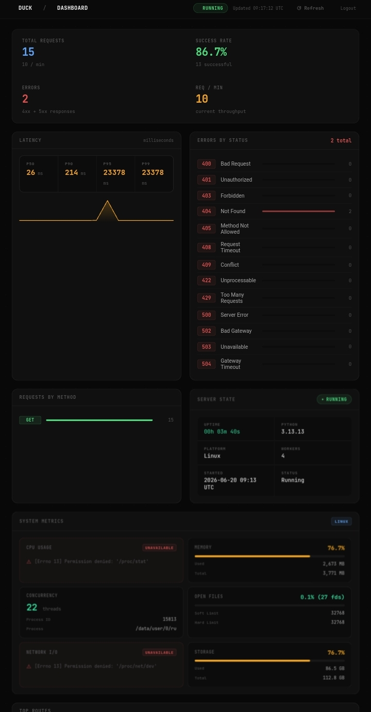

# 💻 Duck Dashboard

Duck includes a built-in dashboard for monitoring application activity and server health in real time. The dashboard provides visibility into requests, responses, logs, errors, latency metrics, routes, and other system information through a modern reactive interface powered by Lively.

The dashboard is enabled by default because `ENABLE_DASHBOARD = True` by default. To disable it entirely, set `ENABLE_DASHBOARD` to a falsey value.

## Authentication

The dashboard is protected using JWT-based authentication.

During development (`DEBUG=True`), Duck uses the dashboard credentials configured in your settings file:

```python
DASHBOARD_USERNAME = "admin"
DASHBOARD_PWD = "admin"
```

In production (`DEBUG=False`), Duck ignores these settings and instead requires the following environment variables:

```bash
DASHBOARD_USERNAME=admin
DASHBOARD_PWD=your-secure-password
```

This helps prevent accidental exposure of dashboard credentials in source code.

## Password Validation

To improve security, Duck performs password-strength validation for dashboard credentials in production environments. Weak passwords are rejected to reduce the risk of unauthorized access.

```{warning}
Password validation can be disabled by setting the environment variable `DISABLE_DASHBOARD_PWD_VALIDATION` to `1` or `true`. Disabling password validation is strongly discouraged and should only be done when absolutely necessary.
```

## Features

- Real-time request monitoring
- Response tracking
- Latency metrics and performance analysis
- Error monitoring and diagnostics
- Application log viewer
- Route inspection
- Server state monitoring
- Reactive updates powered by Lively
- JWT-protected access

## Dashboard Preview


