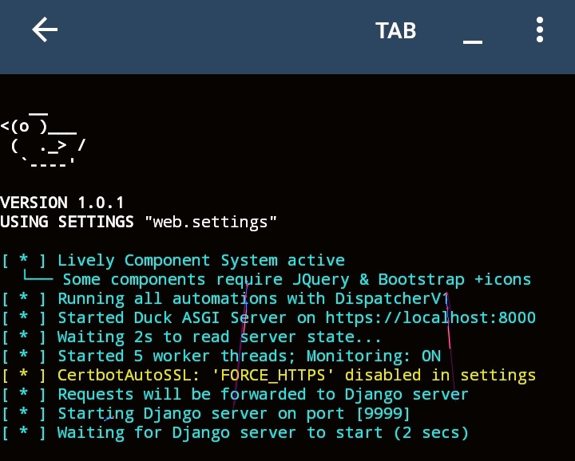

# 🌟 Running the Server

Now comes the exciting part—previewing how your web application looks and behaves in the browser!

To start the Duck server, simply navigate to your project directory and run the following command:

```bash
duck runserver
```

**Alternatively, use:**

```bash
python3 web/main.py
```

The above command will start your Duck web application at `http://localhost:8000` or `https://localhost:8000` if **ENABLE_HTTPS** is enabled in the **settings.py** file.

## Notes

- The `duck runserver` command offers several flags and options that you can use to customize how your application runs.
- Run `duck runserver --help` to explore the available options, which range from adjusting the address and port to running **Duck** with **Django** integration.

## Previewing Your Live Web Application

Once you open your browser at the specified URL, you should see something similar to this:

<video autoplay loop muted playsinline src="_static/videos/duck-local-site.mp4">
  <source src="_static/videos/duck-local-site.mp4" type="video/mp4">
</video>

### Terminal Output After Running `duck runserver`

After executing the `duck runserver` command, your terminal should display output like the examples below:



## Port Conflicts:
If the server fails to start due to a port conflict, check if the port is already in use by another service. You can specify an alternative port by passing the -p <port> argument:

```sh
python3 -m duck runserver -p 8080
```
